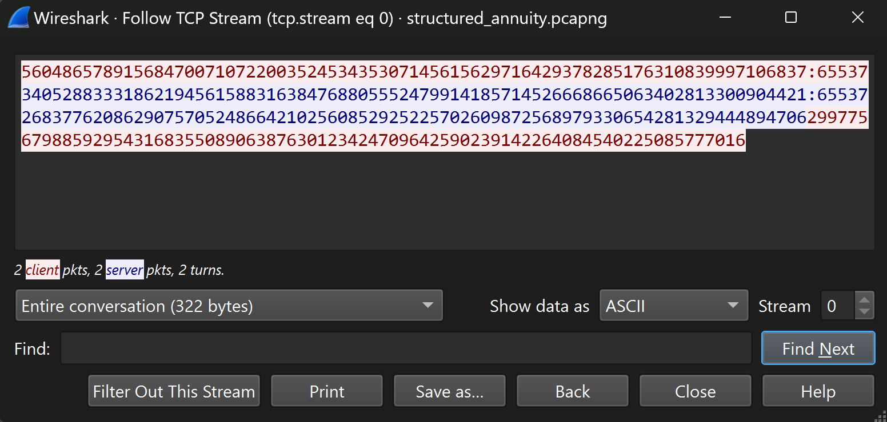

# Structured Annuity

## Description
These J.G. Wentworth ads are getting out of hand! Now we're evem getting reports that they're using malware to try and get people cash for their structured settlements! Luckily, we were able to capture some network traffic of this c2 beacon, along with the binary and a memory capture of the running process. Unfortunately, it seems like the c2 agent contains no static keys and instead generates them at run time. Can you decrypt their comms?

## Difficulty
6/10

## Flag
PCTF{8U7_I_N33D_C@5H_N0W}

## Hints
 - https://research.nccgroup.com/2020/11/11/decrypting-openssh-sessions-for-fun-and-profit/

## Author
Matthew Johnson (meatball5201)

## Tester
Not Yet

## Writeup
A good place to start may be to look at the traffic generated by the c2 server and agent. Following the tcp stream leads to what appears to be two sockets sending ascii numbers back and forth. 



Without reverse engineering the binary, it's challenging to say for sure what is happening, but there are some features that can give us hints about whats happening. The beginning starts with both the server and agent sending a message to each other in the same format of #########:65537. The number 65537 jumps out with it being the standard RSA public exponent. Considering that both sides send different numbers before it, it can be assumed that this is some type of key exchange, perhaps an RSA key exchange.


---
With these assumptions in mind, it's time to start digging into the binary.
The name **Struct**ured Annuity is a hint to the fact that the RSA parameters are stored in a struct after generation. Since the binary was compiled with debugging symbols enabled, we can view this struct when opening it in Cutter / Ghidra. Opening up the binary in Cutter reveals that the first thing the program does is create a new instance of a `rsaKeyStore` struct and populate it with randomly generated primes. Additionally, the rsa.name field is set to "privkey".


Looking at this struct in Cutter reveals that it consists of a name, followed by the RSA parameters p,q,n,e,d,and phi, all with the type mpz_t.


Some research into [mpz_t](https://gmplib.org/manual/Integer-Internals) shows that they are a multiple precision number often used when other C data types aren't large enough. The basic structure is:
1. _mp_size:  4 bytes
2. _mp_alloc: 4 bytes
3. _mp_d:     8 bytes (the one we care about which contains a pointer to the actual number)

Looking below the RSA initialization at the program flow shows the following executing flow:

1. Connect to server
2. Send public key in the format N:E
3. Receive and save public key in the format N:E
4. Receive and decrypt a command
5. Run the command
6. Encrypt and send command output
7. Repeat step 4

This confirms the assumptions that the pcap shows an RSA key exchange. 

Steps 1-3

Steps 4-6


With all of this in mind, we know that in the memory dump, we are looking for a section of memory that fits the struct:

```       
         ("privkey\0")    (size / alloc p)
0x00: 0x0079656b76697270 0x0000000600000009
       (mp_d pointer p)   (size / alloc q)
0x10: 0xDEADBEEFDEADBEEF 0x0000000600000009
       (mp_d pointer q)   (size / alloc n)
0x20: 0xDEADBEEFDEADBEEF 0x0000000600000009
       (mp_d pointer n)   (size / alloc e)
0x30: 0xDEADBEEFDEADBEEF 0x0000000600000009
       (mp_d pointer e)   (size / alloc d)
0x40: 0xDEADBEEFDEADBEEF 0x0000000600000009
       (mp_d pointer d)
0x50: 0xDEADBEEFDEADBEEF
```

---

While there are automated ways of finding and extracting the data in the struct, since we really only need two values, p and q, the easiest way to analyze the dump is to load it into gdb. TO load the dump, run gdb with the `binary` option.

`gdb binary structured_annuity.dump`

Once in GDB, we can begin searching for the struct first by simply printing out some of the stack as strings and checking for it by running `x/100s $rsp` which prints 100 strings off the top of the stack. After a little searching, we can see that the privkey is on the stack at the address `0x7ffc433b6e10`. 


With this information, we can print the memory thats storing the struct by running `x/6gx 0x7ffc433b6e10`.


Comparing this to the diagram earlier, we can see the string literal "privkey" highlighted in red, with the rsa mpz_t primes p and q highlighted in yellow and green respectively. To find the actual integer values of p and q, we need to consult the [mpz_t](https://gmplib.org/manual/Integer-Internals) docs again which tells us that the numbers are stored as 64bit "limbs" ordered as little endian. Starting with P, the first 4 bytes of the entry tells us that it is has 2 of these limbs, and the pointer tells us that they are located at `0x000055d83f75d010`. Knowing this, we can print out these 2 limbs by running `x/2gx 0x000055d83f75d010`.


Because the ordering of these limbs is little endian, in order to get the actual number, we have to swap the order of them before interpreting them as one 128bit integer. For this prime, `0xda5d28fa653fd41d 0xf9fdd04a062c533b` becomes `0xf9fdd04a062c533b 0xda5d28fa653fd41d` becomes `0xf9fdd04a062c533bda5d28fa653fd41d` and is finally interpreted as `p = 332295646661645445201577206886078338077`. The same process is repeated for the next prime, giving us `q = 168671056797319678404059216640521393881`

---

Now that we have the primes, we can decrypt the commands sent by the sever using basic [RSA](https://en.wikipedia.org/wiki/RSA_(cryptosystem)#Decryption).

```
p = 332295646661645445201577206886078338077
q = 168671056797319678404059216640521393881
e = 65537
n = p*q
d = pow(e, -1, lcm(p-1, q-1))
ct = 26837762086290757052486642102560852925225702609872568979330654281329444894706
m = long_to_bytes(pow(ct, d, n))
print(m)
--------------------------------
>>> 'echo PCTF{8U7_I_N33D_C@5H_N0W}'
```


## TL;DR
1. `gdb binary structured_annuity.dump`
2. search for the struct by finding the header "privkey" in the stack with `x/100s $rsp`

3. Print the struct `x/6gx 0x7ffc433b6e10` (Header: Red, P: Yellow, Q: Green)

4. Print the first mpz_t struct with `x/2gx 0x000055d83f75d010`

5. Blocks are stored little endian so flip the two blocks and interpret them as one 128 bit integer. This is P
6. Repeat for Q.
7. Decrypt the servers message from the pcap using these parameters
8. ???????????????
9. echo PCTF{8U7_I_N33D_C@5H_N0W}
