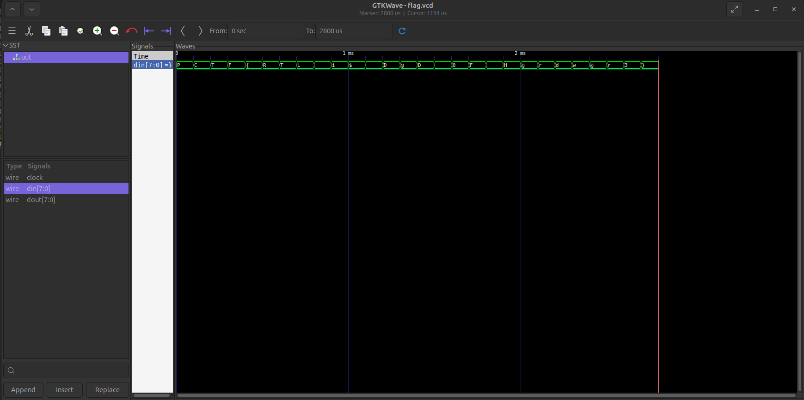

This is an introductory challenge into the world of FPGA.
FPGA are used in various applications from your phone, to
cellular devices for signal processing.


# Challenge Name
HeatTheWave

## Description
Let's Warm up.
Spartan's wanted to create their own ASIC, to secure doors.
One of the spy was able to extract the simulation file,
can you find the password to the door?
*Note*: The spaces are _

## Difficulty
2/10

## Flag
*flag*: PCTF{RTL_i$_D@D_0F_H@rdw@r3}

## Hints
None

## Author


## Tester
Biplav

## Make the challenge
To make the challenge simply run the following command

```bash
cargo build --release
```

### Writeup
You are provided with a file called flag.vcd.
This file contains the simulation results for one of the
test. To view the file one can simply open it with applications
like GTKWave. Which allows you to analyze wave form. The
file format is also open source making it easy to write
your own decoder for it.


