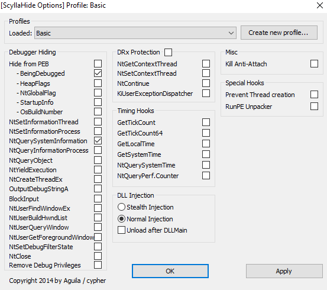

# Full Of Bugs

### Description
De bugs are in me walls 

Flag Format: PCTF{}

### Difficulty
5/10

### Flag
PCTF{tH3_n01$e$_1N_mY_h35D_s4Y_Buzz!}

### Author
Txnner

### Tester
None

### Writeup
Can be solved either statically or dynamically:

#### Static:
- Bypass Anti-debug checks with ScyllaHide (or similar anti-anti-debugger). Minimum ScyllaHide options required:

- Dump process from memory after it unpacks using Scylla (or similar memory dumper)

- Use a static analysis viewer (ghidrda, ida, etc.) to search for the flag function in the code (use known strings to find your way to main)

- Find flag function (other function called in main that is not next to debugger detected string)

- xor global hex value of encoded flag with xor key (offset of 5)

- Solver: solve.py

#### Dynamic:
- Bypass Anti-debug checks with ScyllaHide (or similar anti-anti-debugger). Minimum ScyllaHide options required:

- Debug until the program stops and asks for input

- follow pointers backwards until you discover flag function (will take many restarts)

- watch registers for flag value, which is conveniently loaded but never used.

- Note: there are  better ways to do this dynamically, such as scanning registers for certain values (PCTF) or using a debugger that includes function graphs (IDA) to help follow back functions. Overall though, static analysis is the recommended solution.
